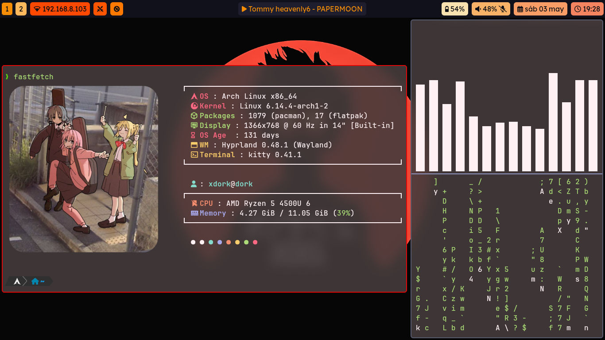

# hypr-dotfiles

Este repositorio simplemente es para guardar mis configuraciones, aplicaciones que más uso, extensiones y keybindings en mi entorno de escritorio.

**Distribución:** Arch Linux  
**Entorno gráfico:** Hyprland  
**Launcher:** Rofi  
**Barra de estado:** Waybar  
**Shell:** Zsh + Powerlevel10k  
**Gestor de archivos:** Thunar  
**Fonts:** JetBrainsMono Nerd Font  
**Bloqueo de pantalla:** Hyprlock  
**Terminal:** Kitty
## Entorno Pastel

## Entorno Hyppuccin

## Entorno Red

## TO-DO
- [X] Linkear configuraciones al directorio wallpaper.
- [X] Añadir un tercer escritorio (calido).
- [X] Añadir configuración kitty.
- [ ] Estandarizar configuraciones entre temas.
